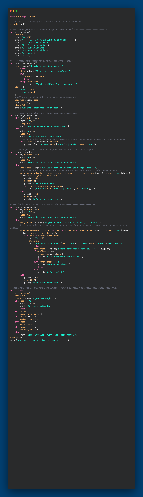
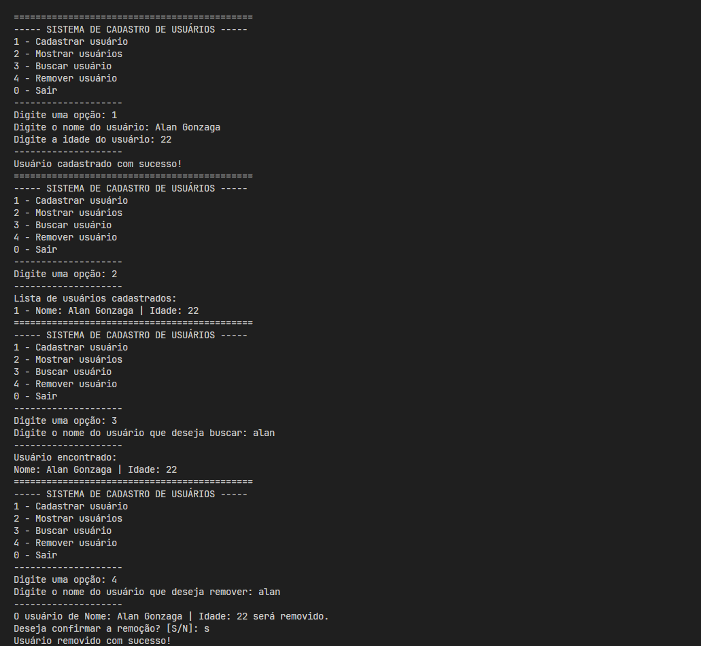

# Sistema de Cadastro de Usuários em Python

Projeto desenvolvido em Python para praticar lógica de programação, funções, listas, dicionários e manipulação de dados em memória.

## ​​📋Funcionalidades

- Cadastrar usuário
- Listar usuários cadastrados
- Buscar usuário por nome
- Remover usuário com confirmação
- Validação de idade
- Menu interativo no terminal

## ​📊​Tecnologias utilizadas

- Python 3.14.2

## 🎯​Objetivo

Este projeto foi criado como parte dos meus estudos em Python, com foco em praticar estruturas básicas da linguagem e organização de código.

## 📷Screenshots

